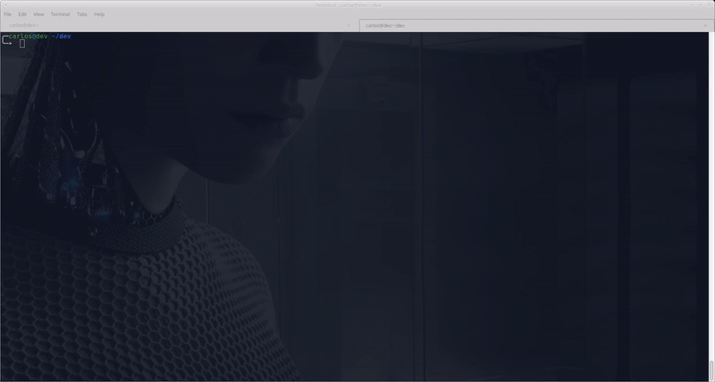

# :icecream: Vanilla JS Boilerplate

Um boilerplate para projetos Vanilla JS (JavaScript puro), dispensando a necessidade de configuração complexas de bundlers como: Webpack, Parcel, Browserif, Rollup e outros...

## :factory: Recursos

* Docker
* Eslint
* Jest
* TypeScript
* Sass
* Pug (template engine)
* Server

## :file_folder: Estrutura

* :file_folder: code
    * :open_file_folder: back-end/
        * ...
    * :open_file_folder: front-end/
        * ...
* :file_folder: docs

## :electric_plug: Instalação

É possível levantar um container **Docker** com todo ambiente configurado, porém para o desenvolvimento no host ser refletido no volume no **Docker** é necessário configurações iniciais.   

> __Nota__: O container **Docker**  é configurado para subir o ambiente a partir do **Node.js** na versão `v18.12.1`. Sendo assim é recomendado que faça o mesmo para o ambiente local (host).

Como instalar **Node.js**:   

__1.__ Via **NVM** - Node Version Manager, consulte o [repositório](https://github.com/nvm-sh/nvm)   
__2.__ Via instalador (executável), consulte a [documentação](https://nodejs.org/en/download)
 
Como instalar o **Docker**, consulte a [documentação](https://docs.docker.com/get-docker)

### Back-end

:construction: ...
### Front-end

### Configurações iniciais

> **Nota**: 
Certifique-se de estar na raiz do diretório **:open_file_folder: front-end/**. 

<div align="center">
    
</div>

---

__1. Instale as dependências__

```
yarn install
```

__2. Habilite arquivos de configuração para JavaScript__   

```
cp jest.config.ts.sample jest.config.ts
cp tsconfig.json.sample tsconfig.json
```

> __Nota__:
Caso seu Shell não entenda o comando `cp`, faça a cópia manualmente. 

__3. Habilite os watchers para os assets__

```
yarn watchers
```

__4. Crie a imagem Docker__


```
docker build -t frontend-boilerplate:v1.0 .
```

__5. Crie o container Docker__

```
docker run --name frontend-boilerplate --network host --volume $(pwd):/front-end frontend-boilerplate:v1.0
```

> __Nota__: 
Caso seu Shell não entenda o comando `pwd`, informe o caminho manualmente, ou use um alias apropriado para indicar diretório corrente.

__6. Acesse seu browser(navegador) em__: [http://localhost:3000](http://localhost:3000).

### :boom: Boom!

## :video_game: Como usar

### Workflow

Uma vez realizada as configurações iniciais, o workflow de desenvolvimento segue:

__1. Ligue o watcher__

```yarn watchers```

__2. Gerencie o container__

```docker start frontend-boilerplate```   
```docker stop frontend-boilerplate```

__3. Acesse Web server__

Em: [http://localhost:3000](http://localhost:3000).

> __Nota__: Servindo em **:open_file_folder: dist/**

###  Setup

O setup está configurado para rodar cada recurso de forma isolada no terminal, caso desejar. Ou se preferir ...

__Lint__:

Roda o linter (avaliação estática) para todos os arquivos JavaScript.   
As regras de validação são baseadas no style guide Idiomatic.js. Caso não tenha familiaridade, veja a documentação do [idiomatic.js](https://github.com/rwaldron/idiomatic.js)

> __Obs__: Instale a extensão Eslint no seu editor para que possa tirar melhor proveito da avaliação estática de código em desenvolvimento.

__comando__: `yarn lint`   

__Testes__:

Roda os testes para todos os arquivos fonte(TypeScript) e gera o relatório de cobertura(coverage) em um pasta com nome **coverage/** na raiz.

__comando__: `yarn test` ou `yarn test:watch`   

__Transpilação JavaScript__:

Transpila/converte todos os TypeScript(.ts) para .js e salva os mesmo no diretório **dist/**, respeitando subdiretórios.

__comando__: `yarn ts` ou `yarn ts:watch`   

__Transpilação CSS__:

Transpila/converte todos os Sass(.sass) para .css e salva os mesmo no diretório **dist/**, respeitando subdiretórios.

__comando__: `yarn css:watch`   

__Transpilação HTML__:

Transpila/converte todos os Pug(.pug - template engine) para .html e salva os mesmo no diretório **dist/**, respeitando subdiretórios.

__comando__: `yarn html:watch`     

__Server__:

Web server servindo o diretório/pasta em **dist/**.

__comando__: `yarn server`

__Node__:

Enquanto desenvolvimento você pode usar o Node pra ler seu arquivos JavaScript sem a necessidade de está com servidor ligado.

__comando__: `dev:node`   


## :package: Build

:construction: ...

### :stuck_out_tongue_winking_eye: That's all folks!